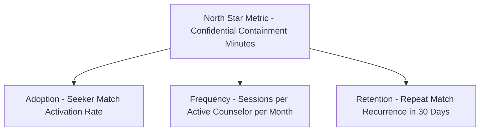
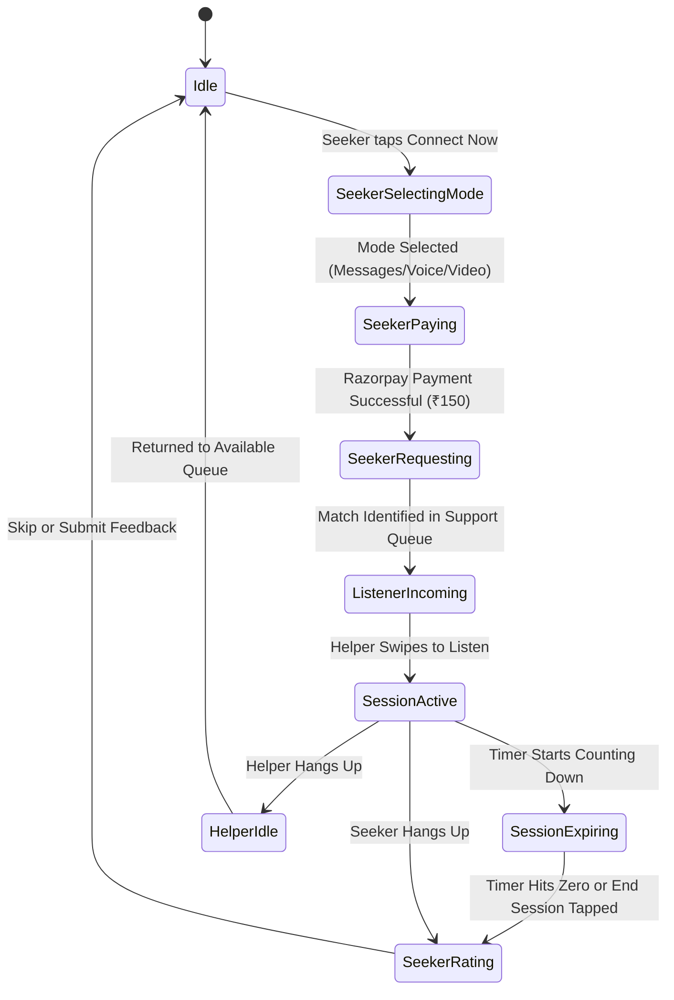
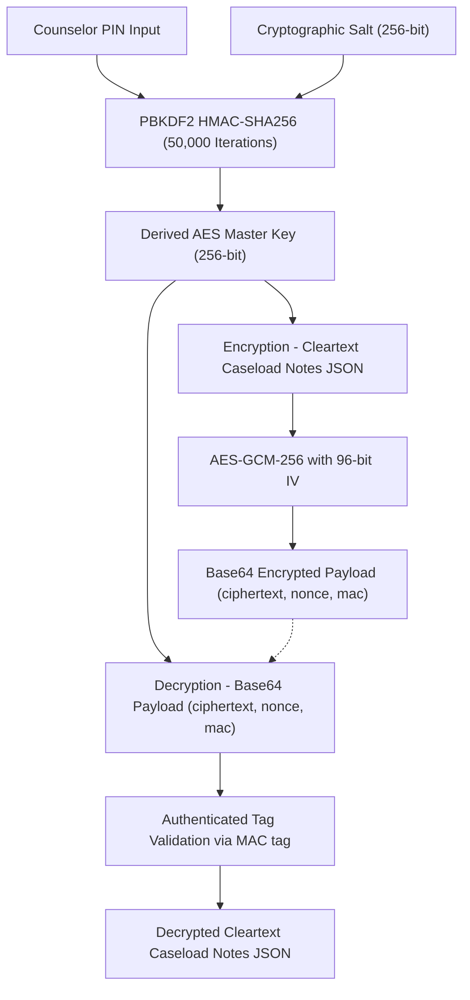

# SafeTalk: Product & Technical Architecture Specifications

SafeTalk is a premium, secure, double-encrypted, and anonymized safe-listening and counseling platform. It bridges the gap between active emotional support, professional clinical therapy, and total seeker confidentiality.

This document serves as the master blueprint for the product’s design system, cryptographic workflows, functional behaviors, user flows, and technical systems.

---

## 🌟 1. Product Mission & Strategy

### The Problem
Traditional mental health avenues are often high-friction, expensive, and present significant privacy concerns. Seekers are hesitant to share vulnerable struggles due to fear of social exposure, digital tracing, or prohibitive pricing structures. Conversely, qualified peer counselors and licensed therapists lack secure, lightweight tools to manage high-confidentiality caseloads, secure journals, and structured timed sessions.

### The Solution: SafeTalk
SafeTalk provides a luminous, zero-trace, glassmorphic haven. By offering anonymous matching, unified low-barrier session pricing (₹150), and locally encrypted client journals, SafeTalk makes professional peer support and prestigious clinical therapy accessible on-demand, under absolute cryptographic protection.

---

## 🎯 2. Product Manager Toolkit: Customer Discovery & JTBD

Applying modern product management frameworks, we define the value proposition using the **Jobs-to-be-Done (JTBD)** framework and target user personas.



### Jobs-to-be-Done (JTBD)
1. **The Seeker's Job**: *"When I am experiencing acute anxiety, stress, or a toxic life situation, I want to immediately match with a qualified, judgment-free listener anonymized under a temporary moniker, so that I can safely vent and receive emotional stabilization without fear of permanent digital footprints or financial strain."*
2. **The Peer Helper's Job**: *"When I am on duty providing peer emotional support, I want a secure dashboard that helps me manage incoming match queues, take secure clinical notes, and protect my personal identity, so that I can focus entirely on active listening."*
3. **The Licensed Therapist's Job**: *"When I am providing professional clinical interventions, I want an elevated, prestigious workspace that distinguishes my verified board status, while retaining absolute cryptographic lockouts on client logs, so that I can uphold the highest standards of professional therapy and secure caseload management."*

---

## 👥 3. Target Audience & User Personas

| Dimension | Seeker (User) | Certified Peer Helper (Listener) | Licensed Clinical Therapist |
| :--- | :--- | :--- | :--- |
| **Persona Moniker** | Anxious Seeker / "Mist Pebble #482" | Compassionate Peer / Amber R. | Verified Clinical Specialist |
| **Primary Goal** | Emotional containment & relief | Active support & secondary income | Clinical diagnosis, counseling & therapy |
| **Theme Alignment** | Terracotta Seeker Theme | Soothing Sage Green Theme | Royal Amethyst Prestige Theme |
| **Pricing Context** | Pays ₹150 per secure timed capsule | Earns standard fee minus platform fee | Earns prestige rate with verified credentials |
| **Caseload Access** | Zero permanent logs (deleted post-session) | Accesses locally-sealed PIN vault | Accesses certified, board-registered journal vault |

---

## ⚙️ 4. System Architecture & State Machine

The interaction loop is managed by `SessionController` (matching and active call states) and `ChatController` (simulated thread history and secure local vaults). Both are wired as global change notifiers that trigger real-time UI swaps on active screens.



---

## 🔒 5. Double-Encryption Vault Architecture

Seeker privacy is protected via a zero-knowledge local database vault inside `VaultService`. Case records never touch an external cloud in cleartext.

### Cryptographic Workflow
1. **Key Derivation (PBKDF2)**:
   - Standard peer counselors or verified therapists set a custom **PIN**.
   - A unique 256-bit cryptographically secure random **salt** is generated.
   - The PIN and salt are passed through **PBKDF2 HMAC-SHA256** with **50,000 iterations** to derive a 256-bit AES Master Key.
2. **Encryption (AES-GCM-256)**:
   - Counselor notes are serialized into cleartext JSON.
   - A unique 96-bit **Initialization Vector (IV/Nonce)** is generated for GCM.
   - The master key, nonce, and cleartext are passed to **AES-GCM-256**, yielding a **ciphertext** and a **128-bit authentication MAC tag**.
   - Payload is stored in local storage as a Base64-encoded package: `ciphertext`, `nonce`, and `mac`.
3. **Zero-Trace Memory Management**:
   - Decrypted notes are held in volatile RAM.
   - Locking the vault immediately overwrites key registers and clears RAM buffers, ensuring absolute forensic protection.



---

## 💸 6. Simplified Razorpay Billing Integration

To streamline high-friction billing steps, SafeTalk simplifies seeker checkouts into a single-action unified gateway.

- **Unified Price Point**: All timed communication modes (Messages, Voice, or Video) cost a standardized **₹150** fee.
- **Razorpay Secure Gateway**: Discarded auxiliary choices (GPay, PhonePe, Paytm, manual UPI inputs). Seekers tap a single preselected "Razorpay Gateway (Recommended)" choice, initiating a secure checkout overlay.
- **Dynamic Checkouts**: The checkout sheet dynamically compiles billing summaries matching the chosen mode:
  - **Messages Session**: 10 Minutes @ ₹150
  - **Voice Call**: 10 Minutes @ ₹150
  - **Video Call**: 7 Minutes @ ₹150

---

## 🎨 7. Design System & Thematic Color Shifting

SafeTalk features a sophisticated, responsive glassmorphic aesthetic built on vanilla CSS values and Dart styling tokens in `tokens.dart`.

### Visual Design Tokens
- **Midnight Canvas** (`0xFFFAF9FC`): A light periwinkle/lavender off-white backing that prevents visual fatigue.
- **Luminous Glass** (`SafeTalkTheme.glassCardDecoration`): Translucent white containers bounded by very light periwinkle borders (`0xFFE4E8F2`), supported by an extremely soft periwinkle drop shadow (`0x0C6C82C5`) to provide elevation.
- **Terracotta Seeker Accents** (`0xFF6C82C5`): A calming, comforting slate periwinkle blue designated for seekers.

### Dynamic Counselor Theme Shifts
SafeTalk automatically changes its entire interface layout color scheme based on the active counselor's credential status:

```
               PEER SPECIALIST                        LICENSED THERAPIST
          ┌───────────────────────┐               ┌───────────────────────┐
          │   Sage Green Theme    │               │ Royal Amethyst Theme  │
          │                       │               │                       │
          │   - brandSage         │               │   - brandTherapist    │
          │     (0xFF537A70)      │               │     (0xFF6B4F82)      │
          │                       │               │                       │
          │   - brandSageLight    │               │   - brandTherapistLight│
          │     (0xFF6B8E86)      │               │     (0xFF836999)      │
          └───────────────────────┘               └───────────────────────┘
```

#### Triggering Shifting Behaviors
1. **Prestige Email Authentication**: During counselor login (`login_screen.dart`), if the input email contains `"therapist"`, the app automatically logs the helper in under therapist credentials (`SessionController().isTherapist = true`).
2. **Interactive Board Verification**: Counselor profiles (`profile_screen.dart`) contain an interactive "Clinical Status" card. Peer helpers can enter a license ID (e.g. `LCSW-99824-A`) and tap "Verify Clinical Credentials" to instantly switch the app theme to Royal Amethyst!
3. **App-wide Propagation**: Layouts, unread channels, notification badges, macro chips, note vault locked status sheets, active session counting timers, and chat bubbles dynamically re-render color aesthetics between Soothing Sage Green and prestige Royal Amethyst Purple immediately.

---

## 📈 8. Product Success Metrics (North Star Framework)

*Based on Product Manager Toolkit best practices.*

1. **North Star Metric: Confidential Containment Minutes (CCM)**
   - *Definition*: The cumulative sum of double-encrypted, safely completed connection minutes across Messages, Voice, and Video sessions.
   - *Why*: Directly reflects the core value delivered to seekers (containment time) and counselors (duty desk utilization).
2. **Leading Metrics (Input Funnel)**:
   - **Activation**: % of matched sessions that complete payment via Razorpay.
   - **Retention**: Seeker recurrence rate (percentage of users returning for another secure match within 30 days).
   - **Prestige Penetration**: % of counselor cohort upgraded to verified Licensed Therapist status.
   - **Macro Empathy Ratio**: Average counselor response time using active empathy macros vs raw inputs.

---

## 📂 9. Developer Guide & Codebase Map

### Folder Structure
```
app/
├── lib/
│   ├── main.dart                  # Application entry point & router
│   ├── controllers/
│   │   ├── session_controller.dart # SessionPhase state & matching controller
│   │   └── chat_controller.dart    # Encrypted notes & chat thread controller
│   ├── services/
│   │   └── vault_service.dart      # AES-GCM + PBKDF2 cryptography service
│   ├── theme/
│   │   └── tokens.dart             # Styling metrics & Sage/Amethyst brand colors
│   ├── screens/
│   │   ├── shared/
│   │   │   ├── login_screen.dart   # Email verification with typing shifts
│   │   │   ├── session_chat_screen.dart # [NEW] Timed messaging capsule room
│   │   │   ├── voice_call_screen.dart   # 10-minute Voice Session screen
│   │   │   └── video_call_screen.dart   # 7-minute Video Session screen
│   │   ├── listener/
│   │   │   ├── accept_user_screen.dart  # Active matching queue & swipe card
│   │   │   ├── listener_layout.dart     # Counselor tab controller with dynamic swappings
│   │   │   ├── messages_screen.dart     # Caseload channels & note vaults
│   │   │   └── profile_screen.dart      # Credentials verification profile tab
│   │   └── user/
│   │       ├── explore_screen.dart      # Seeker connection hub
│   │       ├── request_screen.dart      # Simplified Razorpay billing screen
│   │       └── user_layout.dart         # Seeker routing control
│   └── widgets/
│       ├── breathing_pulse.dart     # Therapeutic breathing animations
│       └── pin_sheet.dart           # Vault PIN security overlay
```

### Static Verification & Analyzer Commands
Ensure the project remains free of compiler issues prior to commits:
```bash
# Execute compilation and syntax checking
flutter analyze
```
