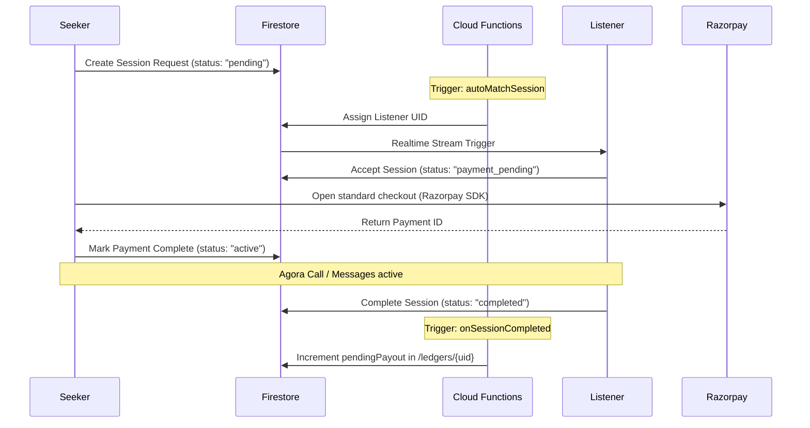

# SafeTalk Seeker-Listener Matching Lifecycle

This page describes the lifecycle of session requests, matching logic, and payment checkout flows.

---

## 1. Interaction Flow Diagram

The state machine is driven by changes to the `sessions` collection in Firestore:

---

## 2. Process Breakdown

1.  **Request Initiation**: A seeker requests a companion. A document is written to `sessions/{sessionId}` with status `"pending"`.
2.  **Autonomous Router (Uber-style matching)**: Firestore trigger `autoMatchSession` executes. It queries available online listeners, matching spoken languages, and updates the session with the listener's UID.
3.  **Acceptance**: The listener accepts the incoming request. The status updates to `"payment_pending"`.
4.  **Payment Checkout**: Seeker completes the transaction via Razorpay.
    *   *Direct Update*: On success, the client updates the session status to `"active"`.
    *   *Webhook Fallback*: The `razorpayWebhook` Cloud Function captures the event, verifies the signature using `RAZORPAY_KEY_SECRET`, and updates the status to `"active"` if not already updated.
5.  **Agora Voice Session**: Users fetch dynamic token details via `generateAgoraToken` and enter [VoiceCallScreen](file:///e:/Coding/safe_talk/app/lib/screens/shared/voice_call_screen.dart).
6.  **Ledger Credit**: Ending the session moves the status to `"completed"`. The Firestore trigger `onSessionCompleted` calculates elapsed minutes and increments `pendingPayout` in `/ledgers/{listenerUid}`.

---

### Navigation
**◄ [Previous: Overview](file:///e:/Coding/safe_talk/docs/architecture/overview.md)** | **[Table of Contents](file:///e:/Coding/safe_talk/docs/system_architecture_specification.md)** | **[Next: Database Schemas](file:///e:/Coding/safe_talk/docs/architecture/database_schema.md) ──►**
